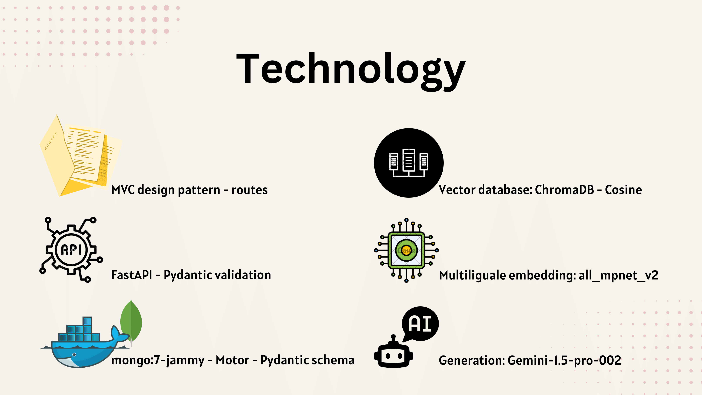

# Intelligent Academic Support System

This project, developed for the **Pioneers of Digital Egypt Initiative**, is a university-focused, AI-driven chatbot system. Designed for multi-user interactions, it provides students with streamlined access to their academic information—grades, course details, faculty information, department data, and general college insights. The system supports both **English and Arabic**, enhancing accessibility for all users.

---

## Project Overview

### Intelligent Interaction with LLMs

The chatbot is powered by advanced Language Learning Models (LLMs) that act as intelligent agents, moderating tasks based on user prompts. The LLM determines the required tool and the order of operations to provide relevant responses, whether retrieving personal data or general information about the university.

---

## Solution Architecture

The solution architecture leverages two primary tools:

1. **Tool 1**: Retrieves personal information from the database for personalized responses.
2. **Tool 2**: Executes a Retrieval-Augmented Generation process with enhanced prompts to handle general university data.

---

## How the System Collects Personal Data

Upon **sign-up** with official university credentials, the system securely scrapes the university website to download a PDF version of the student's transcript. The **Gemini Vision Model** processes this PDF, extracting raw, structured text suitable for MongoDB storage. This includes both the student’s transcript and credential data.

---

## General University Data Collection and Storage

The system collects general university data in JSON format and processes it with a **multilingual embedding model**. This text and its embeddings are stored in a **vector database** (ChromaDB) to enable efficient, accurate retrieval based on user queries.

---

## Technical Infrastructure and Tech Stack

The backend follows an **MVC design pattern** with the following key technologies:

- **FastAPI** for building RESTful APIs.
- **Pydantic** for data validation and database schemas.
- **MongoDB** ("mongo:7-jammy" Docker image) for storage, along with **Motor** for asynchronous database operations and indexing.
- **Chroma Vector Database** for storing embeddings, enabling efficient retrieval based on cosine similarity.

The chatbot system supports secure login/logout endpoints to protect user data, and its server-side design ensures smooth, consistent performance.

---

## Test Cases Slides

These additional slides showcase specific interactions, sample data flow, and technical configurations that further enhance the chatbot’s functionality.

---

## Future Enhancements

This project is open-source and welcomes contributions! Planned features include expanding the chatbot's capabilities, adding more data sources, and enhancing security measures to support additional academic use cases.

---
